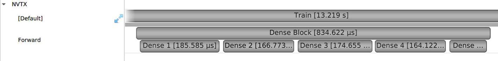
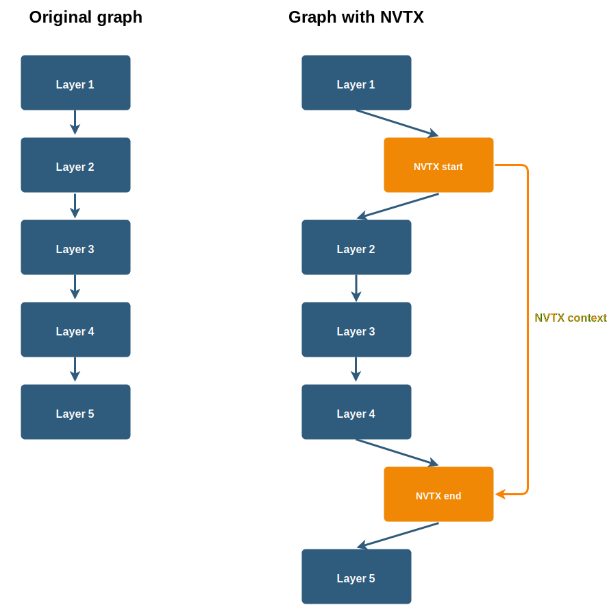

|License|  |Release|  |PyPI-Version|  |PyPI-Implementation|  |Documentation|

NVTX Plugins for Deep Learning
===============================

.. overview-begin-marker-do-not-remove

NVTX Plugins allows users to add their own NVIDIA Tools Extension (NVTX)
events and time ranges to a TensorFlow graph. Applications which integrate NVTX can use NVIDIA
Nsight Systems and Nsight Compute to capture and visualize
these events and time ranges.

The NVTX ranges are added by wrapping regions of the computation graph with
nvtx start and end operations.

NVTX Plugins also provides Keras callbacks and session hooks.

More about:

- NVTX: https://docs.nvidia.com/cuda/profiler-users-guide/index.html#nvtx
- NSight systems: https://developer.nvidia.com/nsight-systems

.. overview-end-marker-do-not-remove

----

Table of Contents
-----------------

- `Installing or building NVTX Plugins`_
- `Quick start guide`_
- `Documentation`_
- `Acknowledgments`_
- `Disclaimer`_
- `Contributions`_
- `Copyright and License`_

----

Installing or building NVTX Plugins
-----------------------------------

Prerequisites
^^^^^^^^^^^^^
- Linux
- Python 3.4+
- NVIDIA GPU + CUDA toolkit 10.0 or newer
- TensorFlow 1.13 or newer

Installing NVTX-Plugins
^^^^^^^^^^^^^^^^^^^^^^^
The package can be installed from PyPI:

.. code-block:: bash

    # Stable release
    pip install nvtx-plugins

    # Pre-release (may present bugs)
    pip install nvtx-plugins --pre

The package is also available for download on github: https://github.com/NVIDIA/nvtx-plugins/releases

.. code-block:: bash

    pip install nvtx-plugins*.tar.gz

Installing from source
^^^^^^^^^^^^^^^^^^^^^^

You can build and install the package from source:

.. code-block:: bash

    python setup.py sdist
    pip install dist/nvtx-plugins*.tar.gz

For development objectives, you can install the package directly from source with:

.. code-block:: bash

    python setup.py install

We recommend building the package inside NVIDIA's NGC TensorFlow container:
https://ngc.nvidia.com/catalog/containers/nvidia:tensorflow

For more information about how to get started with NGC containers, see the
following sections from the NVIDIA GPU Cloud Documentation and the Deep
Learning DGX Documentation: `Getting Started Using NVIDIA GPU
Cloud <https://docs.nvidia.com/ngc/ngc-getting-started-guide/index.html>`_,
`Accessing And Pulling From The NGC container registry <https://docs.nvidia.com/deeplearning/dgx/user-guide/index.html#accessing_registry>`_
and `Running TensorFlow <https://docs.nvidia.com/deeplearning/dgx/tensorflow-release-notes/index.html>`_.

Building the documentation
^^^^^^^^^^^^^^^^^^^^^^^^^^
The documentation is built by running:

.. code-block:: bash

    cd docs
    pip install -r requirements.txt
    make html

The documentation files will be generated in `docs/build/html`

Building the documentation does not require NVTX Plugins to be installed.
Nonetheless, due to an issue in Sphinx **only Python 3.7 is supported** to build the documentation.

----

Quick start guide
-----------------

Adding markers to the graph
^^^^^^^^^^^^^^^^^^^^^^^^^^^
Markers are added by wrapping parts of the computation graph with start and end
operations. The operations are identity ops (passing the input to the output
without modification) but they have a side effect of generating nvtx markers.

.. code-block:: python

    import nvtx.plugins.tf as nvtx_tf

    x, nvtx_context = nvtx_tf.ops.start(x, message='Dense 1-3',
        domain_name='Forward', grad_domain_name='Gradient')
    x = tf.layers.dense(x, 1000, activation=tf.nn.relu, name='dense_1')
    x = tf.layers.dense(x, 1000, activation=tf.nn.relu, name='dense_2')
    x = tf.layers.dense(x, 1000, activation=tf.nn.relu, name='dense_3')
    x = nvtx_tf.ops.end(x, nvtx_context)
    x = tf.layers.dense(x, 1000, activation=tf.nn.relu, name='dense_4')

For convenience, the package also provides a function dectorator:

.. code-block:: python

    @nvtx_tf.ops.trace(message='Dense Block', domain_name='Forward',
                       grad_domain_name='Gradient')
    def dense_block(x):
        x = tf.layers.dense(x, 1000, activation=tf.nn.relu, name='dense_1')
        x = tf.layers.dense(x, 1000, activation=tf.nn.relu, name='dense_2')
        x = tf.layers.dense(x, 1000, activation=tf.nn.relu, name='dense_3')
        return x

More detailed examples can be found in `examples/`, also, check the
Documentation_ for more information about other workflows including
session hooks, Keras layers and callbacks.

Visualizing the ranges
^^^^^^^^^^^^^^^^^^^^^^
NVTX requires a logger to register the generated events and ranges, we will use
NVIDIA Nsight Systems to capture these event.

Run your code with `nsys` (pre-installed in NVIDIA's NGC TensorFlow container) to
generate a `qdrep` file:

.. code-block:: bash

    nsys profile -d 60 \
        -w true \
        --sample=cpu \
        -t 'nvtx,cuda' \
        -o ./generated_timeline \
        python ./network.py

The generated qdrep can be viewed using Nsight Systems.

Nsight Systems and `nsys` can also be downloaded and from the
`NVIDIA''s developer website <https://developer.nvidia.com/nsight-systems>`_.

More details about nsys and Nsight Systems can be found
`here <https://docs.nvidia.com/nsight-systems/index.html>`_.

----

Documentation
-------------
More details about NVTX Plugins can be found on here: https://nvtx-plugins.readthedocs.io/en/latest/

----

Acknowledgments
---------------
The project structure is heavily influenced by the TensorFlow custom-op example:
https://github.com/tensorflow/custom-op

----

Disclaimer
----------
The project is in beta stage, breaking changes are to be expected in the future.

----

Contributions
-------------
Contributions to NVTX Plugins are more than welcome. To contribute code,
please submit a
`pull request <https://help.github.com/articles/using-pull-requests>`_
against the master branch from a local fork.

We appreciate feedback, questions or bug reports. If you need help
with the code, create a
`GitHub issue <https://help.github.com/en/articles/creating-an-issue>`_.
Please follow the process outlined in the Stack Overflow
`<https://stackoverflow.com/help/mcve>`_ document. Ensure that the
posted examples are:

- **minimal**: Use as little code as possible that still produces the same problem.
- **complete**: Provide all parts needed to reproduce the problem.
  Check if you can strip external dependency and still show the problem.
  The less time we spend on reproducing the problems, the more time we
  can dedicate to the fixes.
- **verifiable**: Test the code you are about to provide, to make sure
  that it reproduces the problem. Remove all other problems that are not
  related to your request.

----

Copyright and License
---------------------
This project is released under the Apache License, Version 2.0

.. |License| image:: https://img.shields.io/badge/License-Apache%202.0-blue.svg
   :target: https://opensource.org/licenses/Apache-2.0

.. |Documentation| image:: https://readthedocs.org/projects/nvtx-plugins/badge/?version=latest
   :target: https://nvtx-plugins.readthedocs.io/en/latest/?badge=latest
   :alt: Documentation Status..

.. |Release| image:: https://img.shields.io/github/release/nvidia/nvtx-plugins.svg
   :target: https://github.com/NVIDIA/nvtx-plugins/releases/

.. |PyPI-Version| image:: https://img.shields.io/pypi/pyversions/nvtx-plugins.svg
   :target: https://pypi.org/project/nvtx-plugins/
   :alt: PyPI - Implementation

.. |PyPI-Implementation| image:: https://img.shields.io/pypi/implementation/nvtx-plugins.svg
   :target: https://pypi.org/project/nvtx-plugins/
   :alt: PyPI - Implementation
